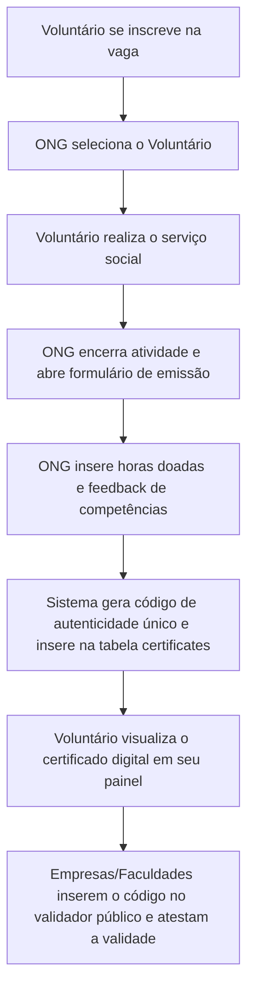
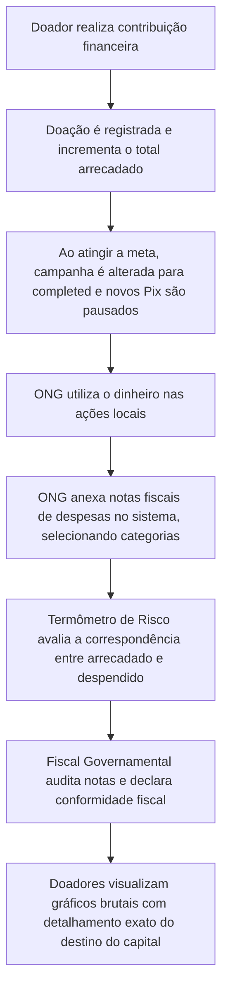
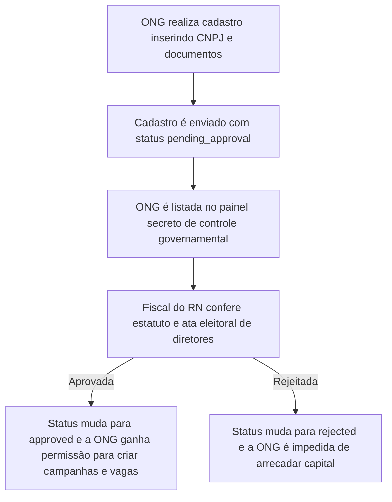

# Documento de Requisitos de Produto (PRD) — PROVI

O **PROVI** é uma plataforma integrada de conexão social, engajamento comunitário e auditoria fiscal de impacto para o estado do Rio Grande do Norte (RN). O projeto visa unificar a busca por vagas de voluntariado, o fomento a doações beneficentes e a total transparência pública na destinação de recursos por meio de um portal de prestação de contas rastreável auditado por fiscais do governo.

---

## 1. Atores do Sistema (Modelos de Negócios)

A plataforma PROVI é estruturada em torno de 5 perfis de usuários distintos, cujos dados e políticas de acesso são definidos no banco de dados ([schema.sql](file:///c:/Users/FelixFamily/Developer/hackathon/supabase/schema.sql)).

| Ator | Descrição | Principais Interações |
| :--- | :--- | :--- |
| **Voluntário** (`volunteer`) | Cidadãos do RN que doam seu tempo e habilidades. | Busca e candidata-se a vagas de voluntariado, registra horas de trabalho e obtém certificados oficiais homologados. |
| **ONG / Instituição** (`institution`) | Organizações sem fins lucrativos que gerenciam ações sociais. | Cadastra campanhas de arrecadação (financeira ou materiais), publica vagas de trabalho, avalia candidatos e emite certificados. Deve obrigatoriamente realizar a prestação de contas (despesas). |
| **Doador** (`donor`) | Pessoas físicas ou jurídicas focadas em apoiar financeiramente. | Contribui financeiramente para as campanhas via Pix ou cartão, acompanha a prestação de contas detalhada e analisa a classificação de risco por inteligência artificial. |
| **Empresa Assinante** (`company`) | Corporações que financiam projetos em troca de selos sociais. | Patrocina campanhas diretamente, adquire planos corporativos para dedução de impostos e visualiza métricas de sustentabilidade social (ESG). |
| **Fiscal do Governo** (`fiscal` ou `admin`) | Agentes governamentais de controle fiscal no RN. | Modera o acesso e a aprovação de novas ONGs (evitando fraudes tributárias), analisa gastos declarados e monitora os painéis estatísticos de impacto macro. |

---

## 2. Estrutura de Telas e Mapeamento de Arquivos

Abaixo estão relacionadas todas as rotas e arquivos de interface implementados na estrutura Next.js App Router do projeto.

### 2.1. Home / Landing Page Pública
* **Rota:** `/`
* **Código-Fonte:** [page.tsx](file:///c:/Users/FelixFamily/Developer/hackathon/src/app/page.tsx)
* **Funcionalidades:**
  * Painel de boas-vindas com título de impacto responsivo e sem cortes.
  * **Card de Destaque Dinâmico**: Renderiza em tempo real a primeira campanha ativa (`status = 'active'`) obtida do banco de dados, exibindo sua foto de capa, localidade e redirecionando o clique diretamente para os detalhes da causa.
  * **Barra de Estatísticas Governamentais**: Grid com dados gerais da plataforma (Voluntários Ativos, ONGs Parceiras, Vagas Abertas, Vidas Impactadas), estilizada com gradiente brutalista nas bordas widescreen para preenchimento amarelo e preto contínuo.
  * **Marquee Animado**: Carrossel infinito horizontal e contínuo exibindo campanhas ativas, com velocidade de leitura calibrada (120s por volta) e sem sobreposição de textos.
  * **CTA Dinâmico**: Botões de conversão direta. O botão "Sou uma ONG" redireciona para o cadastro pré-selecionando o perfil institucional.

### 2.2. Login e Registro Unificado
* **Rota:** `/login` e `/cadastro` (redireciona para o login)
* **Código-Fonte:** [page.tsx](file:///c:/Users/FelixFamily/Developer/hackathon/src/app/login/page.tsx)
* **Funcionalidades:**
  * Formulário de login de dupla funcionalidade (Offline/Fallback com dados `demoUsers` vs Online com Supabase Auth).
  * Criação de conta com fluxos de preenchimento automatizados (busca de endereço via CEP e preenchimento de dados empresariais via CNPJ utilizando chamadas a APIs abertas).
  * **Pré-Seleção de Papel**: Ao receber parâmetros como `role=institution`, a aba correspondente é ativada automaticamente no momento do carregamento para agilizar o cadastro de ONGs.

### 2.3. Painel de Controle (Dashboard do Usuário)
* **Rota:** `/dashboard`
* **Código-Fonte:** [page.tsx](file:///c:/Users/FelixFamily/Developer/hackathon/src/app/dashboard/page.tsx)
* **Componente de Apoio:** [profile-client.tsx](file:///c:/Users/FelixFamily/Developer/hackathon/src/components/profile-client.tsx)
* **Lógicas por Perfil:**
  * **Dashboard de Voluntário**: Acompanha o andamento de candidaturas, exibe o contador acumulativo de horas doadas e lista os certificados oficiais gerados.
  * **Dashboard de ONG**: Permite editar configurações de campanhas, visualizar e gerenciar candidaturas recebidas (aprovando ou rejeitando voluntários) e inclui o **Módulo de Emissão de Certificados**, onde horas e relatórios de feedback são registrados em chaves criptográficas de validação.
  * **Dashboard de Empresa/Doador**: Acompanha doações históricas e planos de fomento ativos.

### 2.4. Explorador de Campanhas e Projetos
* **Rota:** `/campaigns`
* **Código-Fonte:** [page.tsx](file:///c:/Users/FelixFamily/Developer/hackathon/src/app/campaigns/page.tsx)
* **Componente de Apoio:** [campaigns-explorer.tsx](file:///c:/Users/FelixFamily/Developer/hackathon/src/components/campaigns-explorer.tsx)
* **Funcionalidades:**
  * Barra de busca por palavras-chave em títulos e descrições.
  * Filtros de seleção por Município (RN) e Categorias Sociais (Alimentação, Educação, Animais, Saúde, etc.).
  * Lista de resultados disposta em cards neobrutalistas com badges inteligentes e identificador único de auditoria.

### 2.5. Nova Campanha (Portal do Organizador)
* **Rota:** `/campaigns/new`
* **Código-Fonte:** [page.tsx](file:///c:/Users/FelixFamily/Developer/hackathon/src/app/campaigns/new/page.tsx)
* **Funcionalidades:**
  * Formulário passo a passo para cadastro de ações.
  * Seleção condicional de dados entre Pessoa Física (CPF) ou Jurídica (CNPJ).
  * Definição do tipo de necessidade (Doação financeira com chave Pix ou Doação de materiais/insumos).
  * Termos de consentimento para auditoria pública de gastos e conformidade com a LGPD.

### 2.6. Página Interna e Detalhes da Campanha
* **Rota:** `/campaigns/[id]`
* **Código-Fonte:** [page.tsx](file:///c:/Users/FelixFamily/Developer/hackathon/src/app/campaigns/%5Bid%5D/page.tsx)
* **Componente de Apoio:** [campaign-page-client.tsx](file:///c:/Users/FelixFamily/Developer/hackathon/src/components/campaign-page-client.tsx)
* **Funcionalidades Fundamentais:**
  * **Termômetro de Risco por IA**: Classifica e avalia o nível de segurança fiscal da ONG, indicando a procedência e auditoria de suas notas.
  * **Painel de Prestação de Contas (Transparência)**:
    * Seção de arrecadação financeira exibindo a meta, o progresso em percentual e a lista pública de transações recebidas.
    * **Lançamento de Despesas (Visão da ONG)**: Permite ao organizador declarar um gasto, definir sua categoria (Alimentação, Combustível, Logística, Serviços, etc.), escrever a descrição e anexar o link do comprovante/nota fiscal tributária.
    * **Distribuição de Custos**: Gráfico de barras de progresso que calcula dinamicamente o percentual de dinheiro alocado para cada categoria de gasto em relação à receita total.
  * **Timeline (Linha do Tempo)**: Publicação de atualizações oficiais da campanha pelas ONGs organizadoras.
  * **Módulo de Doação**: Gera chave Pix simulada dinâmica com base no valor digitado pelo doador ou processa o pagamento fictício de cartão.

### 2.7. Banco de Vagas de Voluntariado
* **Rota:** `/vagas`
* **Código-Fonte:** [page.tsx](file:///c:/Users/FelixFamily/Developer/hackathon/src/app/vagas/page.tsx)
* **Componente de Apoio:** [job-board.tsx](file:///c:/Users/FelixFamily/Developer/hackathon/src/components/job-board.tsx)
* **Funcionalidades:**
  * Buscador integrado e filtros por Tipo de Atuação (Presencial ou À Distância).
  * Filtros por Competências Exigidas (Design, Didática, Cozinha, Administrativo) e Carga Horária Semanal.
  * **Modal de Candidatura**: Ao clicar em uma vaga, abre-se uma visualização dos requisitos e o botão de inscrição ([apply-button.tsx](file:///c:/Users/FelixFamily/Developer/hackathon/src/components/apply-button.tsx)), que exige login e validação territorial de residência no RN.

### 2.8. Gerenciamento de Candidaturas e Conversas
* **Rota:** `/candidaturas`
* **Código-Fonte:** [page.tsx](file:///c:/Users/FelixFamily/Developer/hackathon/src/app/candidaturas/page.tsx)
* **Funcionalidades:**
  * Acompanhamento de status das inscrições enviadas pelo voluntário.
  * **Chat em Tempo Real**: Canal de chat simulado com resposta automatizada para que o voluntário e o gestor da ONG possam alinhar detalhes de horários e tarefas.

### 2.9. Validação e Busca de Certificados
* **Rota:** `/certificados`
* **Código-Fonte:** [page.tsx](file:///c:/Users/FelixFamily/Developer/hackathon/src/app/certificados/page.tsx)
* **Funcionalidades:**
  * Busca pública e validação por meio do Código de Autenticidade (ex: `LUM-DEMO123`).
  * Ferramenta de auditoria externa para faculdades ou órgãos corporativos validarem horas complementares.

### 2.10. Visualização e Impressão de Certificado
* **Rota:** `/certificados/[code]`
* **Código-Fonte:** [page.tsx](file:///c:/Users/FelixFamily/Developer/hackathon/src/app/certificados/%5Bcode%5D/page.tsx)
* **Componente de Apoio:** [print-button.tsx](file:///c:/Users/FelixFamily/Developer/hackathon/src/components/print-button.tsx)
* **Funcionalidades:**
  * Exibe o diploma oficial digital neo-brutalista com dados do voluntário, da instituição, do projeto social e o número de horas.
  * **Otimização para Impressão A4 Paisagem**: Classes CSS customizadas e media query `@media print` no [globals.css](file:///c:/Users/FelixFamily/Developer/hackathon/src/app/globals.css) garantem que a moldura seja formatada e impressa perfeitamente nas proporções padrão de A4 horizontal, escondendo botões e barras de navegação do site.

### 2.11. Portal do Fiscal Governamental
* **Rota:** `/fiscal`
* **Código-Fonte:** [page.tsx](file:///c:/Users/FelixFamily/Developer/hackathon/src/app/fiscal/page.tsx)
* **Funcionalidades:**
  * **Aba Governamental / Estatísticas**: Gráficos de barra brutais mapeando o avanço geográfico do voluntariado em cidades do RN e as causas de maior foco de atuação.
  * **Aba de Auditoria de ONGs**: Lista de cadastros de ONGs pendentes. Fiscais acessam a ata eleitoral de diretores, cartão do CNPJ e estatuto social da ONG, podendo Aprovar ou Rejeitar a entrada da instituição na plataforma com registro de notas de auditoria.

### 2.12. Feed de Notícias Social
* **Rota:** `/feed`
* **Código-Fonte:** [page.tsx](file:///c:/Users/FelixFamily/Developer/hackathon/src/app/feed/page.tsx)
* **Componente de Apoio:** [feed-list-client.tsx](file:///c:/Users/FelixFamily/Developer/hackathon/src/components/feed-list-client.tsx)
* **Funcionalidades:**
  * Mural social onde organizações e voluntários cadastrados publicam fotos, vídeos e relatos de impacto social.
  * Funcionalidades de engajamento (Likes, compartilhamentos e publicação de comentários em árvore).
  * Controles de paginação infinita assistida (Infinite Scroll) com ref de controle de concorrência (`isLoadingRef`) para evitar alertas de chaves duplicadas.

---

## 3. Modelo de Entidades e Banco de Dados (Supabase)

Os fluxos de negócio operam com base na persistência estruturada no script [schema.sql](file:///c:/Users/FelixFamily/Developer/hackathon/supabase/schema.sql).

### 3.1. Perfis de Usuários (`profiles`)
* **Chave Primária:** `id` (Vinculado ao `auth.users` do Supabase para Single Sign-On).
* **Campos Principais:** `name`, `email`, `city`, `neighborhood`, `profile_type` (`volunteer`, `institution`, `donor`, `company`).
* **Estrutura de Voluntário:** `cpf` (único), `birth_date`, `address`, `profession`, `availability`, `skills` (vetor de strings).
* **Estrutura de ONG:** `cnpj` (único), `representative_name`, `representative_cpf`, `headquarters_address`, `mission`, `social_statute` (link do documento oficial para o fiscal), `approval_status` (`pending_approval`, `approved`, `rejected`).

### 3.2. Campanhas Beneficentes (`campaigns`)
* **Campos Principais:** `organizer_id` (ForeignKey para `profiles`), `title`, `description`, `category`, `city`, `financial_goal`, `financial_raised`, `cover_image`, `pix_key`, `status` (`active`, `completed`, `paused`).

### 3.3. Transações de Entrada e Saída (Prestação de Contas)
* **Tabela de Doações (`donations`):** Mapeia o id da campanha (`campaign_id`), doador (`donor_id`), valor em dinheiro (`amount`) e método de pagamento (`payment_method`). Alimenta o campo `financial_raised` da campanha.
* **Tabela de Despesas (`expenses`):** Armazena notas de saída. Vincula o id da campanha (`campaign_id`), valor pago (`amount`), categoria (`category`), descrição descritiva do produto e a URL do comprovante fiscal digitalizado (`receipt_url`).

### 3.4. Vagas de Voluntariado e Inscrições
* **Vagas (`job_postings`):** Armazena dados das oportunidades de serviço. Campos: `institution_id`, `title`, `description`, `city`, `modality` (`presencial` ou `distancia`), `start_date`, `end_date`, `weekly_hours` e tags de habilidades necessárias.
* **Inscrições (`applications`):** Relaciona a vaga (`job_id`) e o voluntário (`volunteer_id`). Controla o andamento: `status` (`pending`, `selected`, `rejected`) e armazena o histórico de horas registradas (`hours_logged`) para conversão de certificados.

### 3.5. Certificados Digitais (`certificates`)
* **Chaves e Relações:** `volunteer_id`, `institution_id`, `job_id`.
* **Segurança:** Código alfanumérico gerado e criptografado (`verification_code`), imutável e verificável por qualquer agente externo.

---

## 4. Fluxos e Lógicas de Processo de Negócio

Para apoiar a discussão e o alinhamento da lógica entre a equipe de desenvolvimento e o modelo de negócios da PROVI, destacam-se os seguintes fluxos operacionais:

### 4.1. Fluxo de Emissão de Certificados Governamentais (Gamificação e Horas)

### 4.2. Fluxo Tributário de Transparência Social e Combate a Fraudes (Prestação de Contas)

### 4.3. Fluxo de Validação de ONGs no Estado (Segurança do Sistema)

---
*Este documento reflete a modelagem técnica ativa do PROVI e serve como especificação viva de requisitos.*
